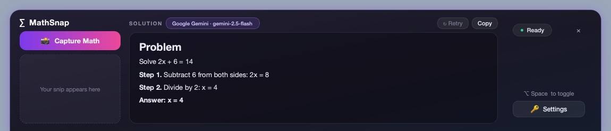
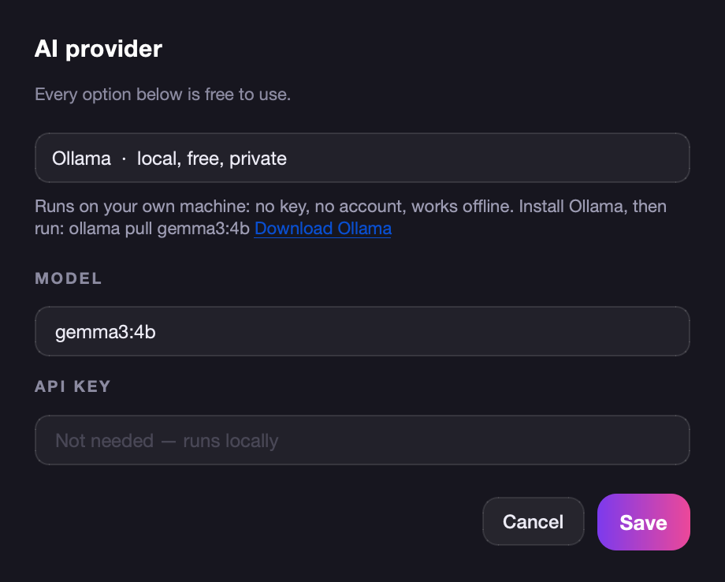

# The Dock of Life

**MathSnap Dock** is a bottom-anchored desktop bar: drag a box around any math problem on your screen and get a step-by-step solution, using an AI provider that costs nothing.



## Free AI options

Pick one in **🔑 Settings**. The model name is editable for every provider.

| Provider | Cost | Key | Default model |
| --- | --- | --- | --- |
| Google Gemini | Free tier, daily limits | [aistudio.google.com/apikey](https://aistudio.google.com/apikey) | `gemini-2.5-flash` |
| Groq | Free tier, rate limited | [console.groq.com/keys](https://console.groq.com/keys) | `meta-llama/llama-4-scout-17b-16e-instruct` |
| OpenRouter | Free models | [openrouter.ai/keys](https://openrouter.ai/keys) | `openrouter/free` |
| Ollama | Free, local, offline, no account | none | `gemma3:4b` |

Keys can also be supplied as `GEMINI_API_KEY`, `GROQ_API_KEY` or `OPENROUTER_API_KEY`. For Ollama, install it from [ollama.com](https://ollama.com/download) and run `ollama pull gemma3:4b`.



## Download (macOS)

**[Download MathSnapDock-arm64.dmg](https://github.com/VirajSinghChadha/the-dock-of-life/releases/latest/download/MathSnapDock-arm64.dmg)** for Apple Silicon Macs. Open it and drag **MathSnap Dock** into Applications.

The app is not notarized by Apple, so the first launch is blocked: open it once, then go to System Settings → Privacy & Security and click **Open Anyway**. Grant it Screen Recording, Accessibility and Input Monitoring there too.

To build the DMG yourself (for example on an Intel Mac), run `./build_dmg.sh`.

## Run from source

```bash
pip install PyQt6 pillow google-genai "pynput>=1.7.7"
python3 mathsnap_dock.py
```

On macOS, grant the app that launches Python (Terminal, iTerm, ...) **Screen Recording**, **Accessibility** and **Input Monitoring** under System Settings → Privacy & Security, then restart it.

## Usage

- `Option+Space` / `Alt+Space`: show or hide the dock
- 📸 Capture Math: drag a red box around a problem (Esc or right-click cancels)
- ↻ Retry: re-solve the last snip, e.g. after switching provider
- ✕: hide the dock
- `Cmd+Q` / `Ctrl+Q`: quit
